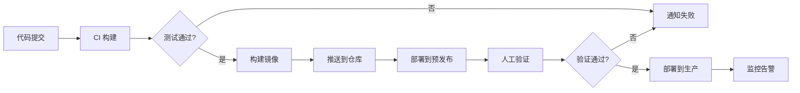

# 项目开发指南

## 一、项目概述

### 1.1 项目定位

本项目是一套基于 Web 的压测管理平台，旨在为开发团队提供完整的性能测试解决方案。平台支持将 HAR 文件一键转换为 Locust 压测场景，提供丰富的场景管理、压测执行、报告分析、环境变量配置等功能。

### 1.2 核心价值

| 价值点 | 说明 |
|--------|------|
| 降低门槛 | Web 界面操作，无需编写代码即可完成压测 |
| 效率提升 | HAR 文件导入，快速生成压测场景 |
| 数据驱动 | 完善的报告分析，支持历史对比 |
| 灵活配置 | 环境变量、数据源满足复杂业务场景 |
| 一体化 | 接口测试与性能测试一体化 |

### 1.3 技术架构总览

| 层级 | 技术选型 | 说明 |
|------|----------|------|
| 前端框架 | Vue 3 + Element Plus | 组件化开发，响应式界面 |
| 后端框架 | Django + DRF | 成熟的 Web 框架 |
| 数据库 | SQLite（开发）/MySQL（生产） | 关系型数据库 |
| 消息队列 | Celery + Redis | 异步任务处理 |
| 压测引擎 | Locust | Python 编写的压测工具 |
| 容器化 | Docker | 标准化部署 |
| 图表展示 | ECharts | 数据可视化 |

---

## 二、开发阶段规划

### 2.1 阶段一：基础设施建设（预计 1-2 周）

#### 目标

搭建完整的开发环境和基础设施，为后续功能开发奠定基础。

#### 任务清单

| 序号 | 任务 | 优先级 | 负责人 | 工时 |
|------|------|--------|--------|------|
| 1.1 | 项目初始化（前后端脚手架） | P0 | - | 4h |
| 1.2 | 数据库模型设计 | P0 | - | 8h |
| 1.3 | 用户认证系统 | P0 | - | 16h |
| 1.4 | 开发环境搭建文档 | P1 | - | 4h |
| 1.5 | CI/CD 基础配置 | P1 | - | 8h |

#### 交付物

- 项目代码框架
- 数据库迁移脚本
- 用户认证 API
- 开发环境搭建指南

### 2.2 阶段二：核心功能开发（预计 3-4 周）

#### 目标

完成场景管理、HAR 导入、压测执行等核心功能。

#### 任务清单

| 序号 | 任务 | 优先级 | 工时 |
|------|------|--------|------|
| 2.1 | 场景 CRUD API | P0 | 16h |
| 2.2 | HAR 解析器 | P0 | 24h |
| 2.3 | 场景编辑器前端 | P0 | 24h |
| 2.4 | HAR 导入前端 | P0 | 8h |
| 2.5 | 压测执行引擎 | P0 | 32h |
| 2.6 | 实时监控前端 | P0 | 16h |
| 2.7 | 基础权限控制 | P1 | 8h |

#### 交付物

- 场景管理完整功能
- HAR 一键导入
- 压测执行与实时监控
- 核心 API 接口

### 2.3 阶段三：报告与分析（预计 2 周）

#### 目标

完成压测报告存储、展示和分析功能。

#### 任务清单

| 序号 | 任务 | 优先级 | 工时 |
|------|------|--------|------|
| 3.1 | 报告存储服务 | P0 | 16h |
| 3.2 | 报告列表 API | P0 | 8h |
| 3.3 | 报告详情 API | P0 | 8h |
| 3.4 | 报告图表前端 | P0 | 24h |
| 3.5 | 报告对比功能 | P2 | 16h |
| 3.6 | 报告导出功能 | P2 | 8h |

#### 交付物

- 完整报告管理系统
- 多维度图表展示
- 报告对比功能

### 2.4 阶段四：扩展功能（预计 2 周）

#### 目标

完成环境变量、数据源、接口测试等扩展功能。

#### 任务清单

| 序号 | 任务 | 优先级 | 工时 |
|------|------|--------|------|
| 4.1 | 环境变量管理 | P1 | 16h |
| 4.2 | CSV/JSON 数据源 | P1 | 16h |
| 4.3 | 数据库数据源 | P2 | 16h |
| 4.4 | 数据源绑定 | P2 | 16h |
| 4.5 | 测试套件管理 | P2 | 16h |
| 4.6 | 断言规则引擎 | P2 | 16h |

#### 交付物

- 环境变量管理系统
- 多类型数据源支持
- 接口测试基础功能

### 2.5 阶段五：优化与完善（预计 1-2 周）

#### 目标

性能优化、安全加固、文档完善。

#### 任务清单

| 序号 | 任务 | 优先级 | 工时 |
|------|------|--------|------|
| 5.1 | 性能测试与优化 | P1 | 16h |
| 5.2 | 安全审计与加固 | P0 | 16h |
| 5.3 | 单元测试补充 | P1 | 16h |
| 5.4 | 完整文档编写 | P1 | 8h |
| 5.5 | 用户手册编写 | P2 | 8h |

#### 交付物

- 性能优化报告
- 安全加固清单
- 完整测试用例
- 用户使用手册

---

## 三、技术决策记录

### 3.1 数据库选型

| 决策项 | 选项 | 选择 | 原因 |
|--------|------|------|------|
| 开发数据库 | SQLite / MySQL | SQLite | 零配置，易于开发 |
| 生产数据库 | MySQL / PostgreSQL | MySQL | 团队熟悉，运维简单 |
| ORM | Django ORM | Django ORM | 与 Django 深度集成 |
| Redis 缓存 | 是 / 否 | 是 | 支持 Celery 和缓存 |

### 3.2 前端技术选型

| 决策项 | 选项 | 选择 | 原因 |
|--------|------|------|------|
| 框架 | Vue 2 / Vue 3 | Vue 3 | Composition API，更好的类型支持 |
| UI 库 | Element UI / Ant Design Vue / View UI | Element Plus | 文档完善，与 Vue 3 兼容 |
| 状态管理 | Vuex / Pinia | Pinia | 更轻量，TypeScript 支持好 |
| 构建工具 | Webpack / Vite | Vite | 开发体验好，速度快 |
| 图表库 | ECharts / Chart.js / D3 | ECharts | 功能强大，文档完善 |

### 3.3 后端技术选型

| 决策项 | 选项 | 选择 | 原因 |
|--------|------|------|------|
| Web 框架 | Django / Flask / FastAPI | Django | 完整生态，ORM 优秀 |
| API 框架 | DRF / Ninja / Starlette | DRF | 与 Django 集成好 |
| 压测引擎 | Locust / JMeter /wrk | Locust | Python 生态，纯代码配置 |
| 任务队列 | Celery / RQ / Dramatiq | Celery | 最流行，文档完善 |
| 认证方式 | Session / JWT | JWT | 无状态，易于分布式 |

### 3.4 部署技术选型

| 决策项 | 选项 | 选择 | 原因 |
|--------|------|------|------|
| 容器化 | Docker / Podman | Docker | 生态成熟 |
| 编排 | Docker Compose / K8s | Docker Compose | 简单场景足够 |
| 反向代理 | Nginx / Caddy | Nginx | 高性能，稳定 |
| CI/CD | GitHub Actions / GitLab CI | GitHub Actions | 免费，集成好 |

---

## 四、开发规范

### 4.1 Git 使用规范

#### 分支策略

| 分支 | 说明 | 命名规则 |
|------|------|----------|
| main | 主分支，生产环境 | main |
| develop | 开发主分支 | develop |
| feature/* | 功能分支 | feature/功能名称 |
| release/* | 发布分支 | release/v版本号 |
| hotfix/* | 紧急修复 | hotfix/问题描述 |

#### 提交规范

```
<type>(<scope>): <subject>

<body>

<footer>
```

Type 类型：

| 类型 | 说明 |
|------|------|
| feat | 新功能 |
| fix | Bug 修复 |
| docs | 文档更新 |
| style | 代码格式 |
| refactor | 重构 |
| test | 测试相关 |
| chore | 构建/工具 |

#### 示例

```
feat(scenarios): 添加场景复制功能

- 支持一键复制已有场景
- 复制时自动重命名
- 复制完成后跳转到新场景编辑页

Closes #123
```

### 4.2 代码规范

#### Python 规范

| 规范 | 要求 |
|------|------|
| 风格 | PEP 8 |
| 格式化 | Black |
| Import 排序 | isort |
| 类型检查 | mypy |
| 最大行宽 | 88 字符 |

#### JavaScript/Vue 规范

| 规范 | 要求 |
|------|------|
| 代码检查 | ESLint |
| 格式化 | Prettier |
| Vue 风格 | Composition API |
| 组件命名 | PascalCase |

### 4.3 API 设计规范

#### URL 规范

| 类型 | 格式 | 示例 |
|------|------|------|
| 资源列表 | GET /api/v1/resources | GET /api/v1/scenarios |
| 单个资源 | GET /api/v1/resources/:id | GET /api/v1/scenarios/123 |
| 创建 | POST /api/v1/resources | POST /api/v1/scenarios |
| 更新 | PUT /api/v1/resources/:id | PUT /api/v1/scenarios/123 |
| 删除 | DELETE /api/v1/resources/:id | DELETE /api/v1/scenarios/123 |

#### 响应格式

```json
{
  "code": 0,
  "message": "success",
  "data": {},
  "meta": {
    "pagination": {}
  }
}
```

### 4.4 数据库规范

#### 命名规范

| 类型 | 规则 | 示例 |
|------|------|------|
| 表名 | 小写下划线 | user_profile |
| 字段名 | 小写下划线 | created_at |
| 主键 | UUID | id |
| 外键 | _id 后缀 | scenario_id |

#### 通用字段

| 字段 | 类型 | 说明 |
|------|------|------|
| id | UUID | 主键 |
| created_at | DateTime | 创建时间 |
| updated_at | DateTime | 更新时间 |
| is_deleted | Boolean | 软删除 |

---

## 五、接口设计原则

### 5.1 RESTful 设计

| 操作 | HTTP 方法 | URL 模式 |
|------|-----------|----------|
| 获取资源 | GET | /api/v1/resources |
| 获取单个资源 | GET | /api/v1/resources/:id |
| 创建资源 | POST | /api/v1/resources |
| 更新资源 | PUT | /api/v1/resources/:id |
| 删除资源 | DELETE | /api/v1/resources/:id |
| 部分更新 | PATCH | /api/v1/resources/:id |
| 自定义操作 | POST | /api/v1/resources/:id/action |

### 5.2 错误处理

| HTTP 状态码 | 说明 |
|-------------|------|
| 200 | 成功 |
| 201 | 创建成功 |
| 400 | 请求参数错误 |
| 401 | 未认证 |
| 403 | 无权限 |
| 404 | 资源不存在 |
| 500 | 服务器错误 |

### 5.3 分页设计

| 参数 | 类型 | 说明 |
|------|------|------|
| page | int | 页码，从 1 开始 |
| page_size | int | 每页数量 |
| total | int | 总数 |
| total_pages | int | 总页数 |

---

## 六、测试策略

### 6.1 测试覆盖要求

| 类型 | 覆盖率要求 | 说明 |
|------|------------|------|
| 单元测试 | >= 60% | 核心业务逻辑 |
| 集成测试 | >= 40% | API 接口 |
| E2E 测试 | 核心流程 | 关键功能 |

### 6.2 测试优先级

| 优先级 | 测试内容 |
|--------|----------|
| P0 | 核心业务流程 |
| P1 | 主要功能模块 |
| P2 | 次要功能 |
| P3 | 边界情况 |

### 6.3 测试环境

| 环境 | 数据库 | 说明 |
|------|--------|------|
| 开发 | SQLite | 本地开发 |
| 测试 | MySQL | CI/CD 环境 |
| 预发布 | MySQL | 生产镜像测试 |

---

## 七、部署策略

### 7.1 环境划分

| 环境 | 说明 | 配置 |
|------|------|------|
| 开发环境 | 本地开发 | SQLite，本地服务 |
| 测试环境 | QA 测试 | MySQL，独立部署 |
| 预发布环境 | 上线前验证 | 生产配置 |
| 生产环境 | 正式服务 | 高可用配置 |

### 7.2 部署流程



### 7.3 滚动更新策略

- 零停机部署
- 蓝绿部署或金丝雀发布
- 自动回滚机制

---

## 八、监控与运维

### 8.1 监控指标

| 指标 | 告警阈值 | 说明 |
|------|----------|------|
| API 响应时间 | > 500ms | P95 |
| 错误率 | > 1% | 5 分钟平均 |
| CPU 使用率 | > 80% | 持续 5 分钟 |
| 内存使用率 | > 85% | 持续 5 分钟 |
| 磁盘使用率 | > 90% | 任意分区 |

### 8.2 日志规范

| 日志级别 | 使用场景 |
|----------|----------|
| DEBUG | 调试信息，开发环境 |
| INFO | 正常操作记录 |
| WARNING | 警告信息，不影响功能 |
| ERROR | 错误信息，影响功能 |
| CRITICAL | 严重错误，系统异常 |

### 8.3 备份策略

| 类型 | 频率 | 保留时间 |
|------|------|----------|
| 数据库全量 | 每天 | 7 天 |
| 数据库增量 | 每小时 | 24 小时 |
| 文件备份 | 每天 | 7 天 |

---

## 九、文档管理

### 9.1 文档类型

| 类型 | 说明 | 位置 |
|------|------|------|
| 设计文档 | 架构设计、详细设计 | docs/ |
| API 文档 | 接口说明 | docs/02-系统设计/03-API接口设计文档.md |
| 部署文档 | 部署指南 | docs/04-部署方案/ |
| 用户手册 | 使用说明 | docs/ |
| 代码注释 | 函数、类注释 | 代码中 |

### 9.2 文档更新

- 功能开发时同步更新文档
- API 变更时更新接口文档
- 重大重构后更新架构文档

---

## 十、附录

### 10.1 参考文档

| 文档 | 链接 |
|------|------|
| Django 官方文档 | https://docs.djangoproject.com |
| DRF 官方文档 | https://www.django-rest-framework.org |
| Vue.js 官方文档 | https://vuejs.org |
| Element Plus 官方文档 | https://element-plus.org |
| Locust 官方文档 | https://docs.locust.io |
| Docker 官方文档 | https://docs.docker.com |

### 10.2 工具推荐

| 用途 | 工具 |
|------|------|
| API 测试 | Postman / Apifox |
| 数据库管理 | DBeaver / Navicat |
| Redis 管理 | Redis Desktop Manager |
| Docker 管理 | Docker Desktop / Portainer |
| 日志查看 | Loggly / ELK |

### 10.3 常见问题

| 问题 | 解决方案 |
|------|----------|
| 开发环境搭建失败 | 参考本地开发环境搭建指南 |
| 接口调试失败 | 使用 Postman 先验证 API |
| 性能问题 | 先检查数据库索引和缓存 |
| 部署问题 | 查看 Docker 日志排查 |
